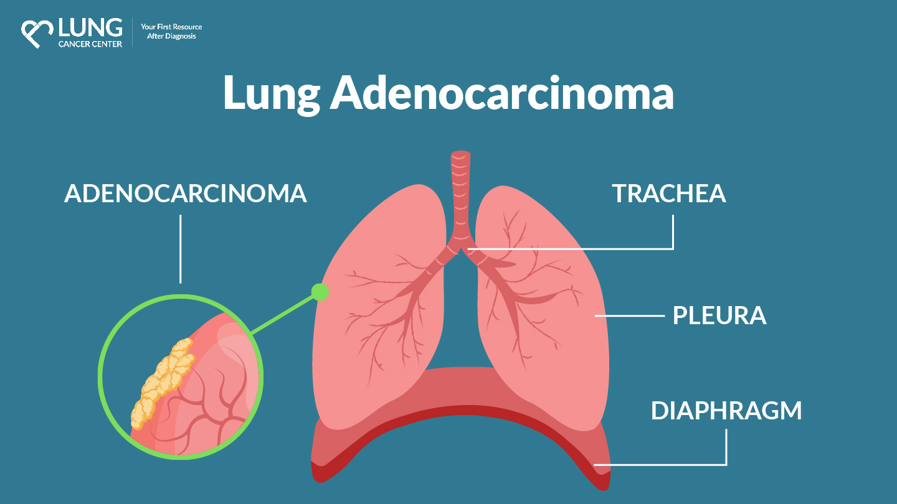

Lung Cancer Detection using VGG16

📌 Project Overview

This project aims to detect lung cancer (Adenocarcinoma) using deep learning techniques. We leverage VGG16 with transfer learning to classify lung images into two categories:
Normal
Adenocarcinoma Cancer

📂 Dataset

The dataset consists of lung CT scan images categorized as Normal and Adenocarcinoma Cancer.
Data augmentation is applied to improve generalization.

🛠️ Tech Stack

Programming Language: Python

Libraries: TensorFlow, Keras, NumPy, OpenCV, Matplotlib

Model Used: VGG16 (Pretrained on ImageNet)

Loss Function: Categorical Crossentropy

Optimizer: SGD
